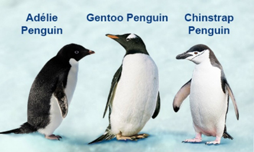

------------------------------------------------------------------------

**Load packages and penguin data**

```{r message = FALSE}
library(tidyverse)
library(palmerpenguins)
library(GGally) ## scatterplot matrices
library(corrr) ## correlation matrices
library(ComplexHeatmap) ## heatmaps
library(factoextra) ## principal components analysis plots
library(viridis) ## colorblind-friendly color palettes
```

------------------------------------------------------------------------



**Create data frame without missing values**

```{r}
penguins_df <- penguins %>% drop_na()
penguins_df
```

*Note: use caution with `drop_na()`! Make sure you know what this is doing first. Use `?drop_na` to learn more about this function in the Help panel of RStudio. Also look at the original penguins data to find out what you are dropping.*

```{r}
?drop_na
View(penguins)
```

------------------------------------------------------------------------

## Plot Grids (or Matrices)

There are many types of plot grids (matrices) - you can combine different types of plots in each cell of the grid, or you can create the same type of plot in each cell of the grid. Here we will cover two different types of plots that show correlations between each pair of continuous variables in a dataset.

Correlation coefficients typically have two dimensions:

-   **Direction**: do values tend to go in the same or in opposite directions?
    -   Positive correlation coefficients (sign is +) mean that values go in the same direction
    -   Negative correlation coefficients (sign is -) mean that values go in opposite directions
-   **Strength** **(or Magnitude)**: how much (un)certainty is there in the relationship?
    -   Strong correlation coefficients are close to -1 or +1
    -   Weak correlation coefficients are close to 0

Pearson correlation statistics are often used to describe how continuously measured variables that come from a normal distribution are related. If this assumption does not hold up (and there are ways to test this visually and statistically), you can use alternate correlation statistics such as Spearman correlations. But we will use Pearson's correlations in these examples.

Assuming flipper length and bill length are normally distributed, let's look at the Pearson correlation between them. We will use the `correlate()` function from the `corrr` package. Before you use the function (or any function in R), find out more by using a `?` followed by the function name to pull up the help file.

```{r message = FALSE}
?correlate

penguins_df %>%
  select(flipper_length_mm, body_mass_g) %>%
  correlate()
```

Since the sign is positive, this means they go in the same direction (longer flipper lengths are correlated with higher body mass). Since the value is closer to 1 than 0, we would say this is a relatively strong correlation.

------------------------------------------------------------------------

**The scatterplot revisited**

Let's plot flipper versus body mass against each other and think about how this relates to the correlation coefficient that we see above. We will add the correlation coefficient to the plot too for fun using geom_text and the rounded value of 0.873 that we saw above.

```{r}
penguins_df %>% 
  ggplot() +
    geom_point(mapping = aes(x = flipper_length_mm, 
                             y = body_mass_g)) +
    geom_text(mapping = aes(x = 180, y = 6000, ## actual x & y values where text should go
                            label = paste("Pearson's correlation = 0.873")))
```

------------------------------------------------------------------------

**Scatterplot matrices**

Let's look at all of the pairwise correlations between continuous variables measuring flipper length, bill length, bill depth, and body mass.

```{r message = FALSE}
penguins_df %>%
  select(flipper_length_mm, bill_length_mm, bill_depth_mm, body_mass_g) %>%
  correlate()
```

The scatterplot matrix can show us all of these at once, and we will use the `ggpairs()` function from the `GGally` package. Since this uses ggplot2 we can add ggplot2 layers that help us customize the look and feel (such as themes, labels, colors, etc). Will keep it simple here but will just add the black and white theme.

```{r message = FALSE}
?ggpairs

penguins_df %>%
  select(flipper_length_mm, bill_length_mm, bill_depth_mm, body_mass_g) %>%
  ggpairs() +
  theme_bw()
```

A bonus with `ggpairs()` is that we get the correlation coefficients, significance level flags (the asterisks after the correlation coefficient), and smooth curves for each single variable to give you a rough sense of the distribution distribution.

------------------------------------------------------------------------

**Correlation heatmaps**

Another way to display the correlation matrix above, which is even simpler visually (sometimes nice), is to use a correlation heatmap. This uses colors and color intensity to indicate direction and strength of the correlations. The `autoplot()` function from the `corrr` package can do this for us:

```{r message = FALSE}
penguins_df %>%
  select(flipper_length_mm, bill_length_mm, bill_depth_mm, body_mass_g) %>%
  correlate() %>%
  autoplot()
```

------------------------------------------------------------------------

## Heatmaps

The correlation matrix plot above is a heatmap of sorts, but more commonly, we see heatmaps used in the context of high-dimension studies where there are many variables measured (e.g. in genomics and machine learning applications). There is usually some type of clustering algorithm that helps you to identify values that are similar (and dissimilar) both mathematically and visually. More information about clustering algorithms can be found [here](https://developers.google.com/machine-learning/clustering/clustering-algorithms).

Let's create a heatmap usin the penguin data, and then we will break it down.

```{r}
?Heatmap ## requires matrix input

penguins_df %>%
  select(flipper_length_mm, bill_length_mm, bill_depth_mm, body_mass_g) %>% ## select numeric variables
  as.matrix() %>% ## convert to matrix with rownames = species
  scale() %>% ## center and scale (standardize) the columns to have mean=0, sd=1
  Heatmap() 
```

------------------------------------------------------------------------

The low values are blue and the high values are red. Each row is an individual penguin, and each column is a measurement. Penguins with similar measurements are grouped together by the clustering of the rows, and clusters are displayed with a **dendrogram** on the y-axis.

Now let's make an enhanced heatmap, where we apply the following modifications:

-   Separate the clusters by penguin species
-   Increase the size of the dendrogram on the left for easier cluster viewing
-   Use a colorblind-friendly palette with the `viridis` package.
-   Apply nicer labels.

```{r}
penguins_df %>%
  select(flipper_length_mm, bill_length_mm, bill_depth_mm, body_mass_g) %>% ## select numeric variables
  as.matrix() %>% ## convert to matrix with rownames = species
  scale() %>% ## center and scale (standardize) the columns to have mean=0, sd=1
  Heatmap(col = viridis(n = 256),
          column_labels = c("Flipper Length", "Bill Length", "Bill Depth", "Body Mass"),
          column_names_rot = 45, 
          heatmap_legend_param = list(title = "Z-score"),
          row_dend_width = unit(50, "mm"),
          split = penguins_df$species) 
```

Are these species different? They look like they are based on the color patterns, but you should also use the clustering statistics in addition to the colors. Using the clustering statistics can help you to answer questions such as:

-   What measurements distinguish each species?
-   Could you identify sub-species?

This is beyond the scope of this course but food for thought and motivation to learn more about clustering statistics.

------------------------------------------------------------------------

## Dimension Reduction Plots

Dimension reduction is used to identify which variables you can combine together.

There are a few different techniques for reducing dimensions. We cannot cover them all here, but here are a few examples of methods that fall into this category:

-   Multi-Dimensional Scaling (MDS)
-   Principal Components Analysis (PCA)
-   Uniform Manifold Approximation and Projection (UMAP)
-   t-distributed Stochastic Neighbor Embedding (t-SNE)

Each has different advantages and give different types of information. Let's see how to do a PCA plot since this is commonly used in multiple applications.

------------------------------------------------------------------------

**PCA plots**

We will use the `factoextra` package to create PCA plots. First we have to apply the PCA method and save it into an object. For consistency with what we were doing above, we will select and scale the flipper and bill length, bill depth, and body mass variables.

```{r}
penguins_df %>%
  select(flipper_length_mm, bill_length_mm, bill_depth_mm, body_mass_g) %>% 
  as.matrix() %>% ## convert to matrix with rownames = species
  scale() %>% ## center and scale (standardize) the columns to have mean=0, sd=1
  prcomp() ## get principal components
```

There are 4 principal components here which capture different amounts of variation in the data. The first one (PC1) captures most of the variance, the last one captures the least overall variance.

The magnitude and sign of each value in the table above represents how much that variable contributes to the PC and in which direction, respectively. In PC1 and PC2, we see that flipper length and body mass have similar values both in magnitude and sign, which indicates that they provide similar information. This is consistent with what we saw above in the correlation matrix as well as in the heatmap. Bill length and depth, however, seem to be providing different information.

```{r}
penguins_df %>%
  select(flipper_length_mm, bill_length_mm, bill_depth_mm, body_mass_g) %>% 
  as.matrix() %>% ## convert to matrix with rownames = species
  scale() %>%
  prcomp() %>%
  fviz_pca_var()
```

We can also apply PCA to the observations (penguins) and overlay this with the plot above. We will color the penguins by species.

```{r}
penguins_df %>%
  select(flipper_length_mm, bill_length_mm, bill_depth_mm, body_mass_g) %>% 
  as.matrix() %>% ## convert to matrix with rownames = species
  scale() %>%
  prcomp() %>%
  fviz_pca_biplot(habillage = penguins_df$species,
               palette = viridis(n = 3),
               label = "var")
```
